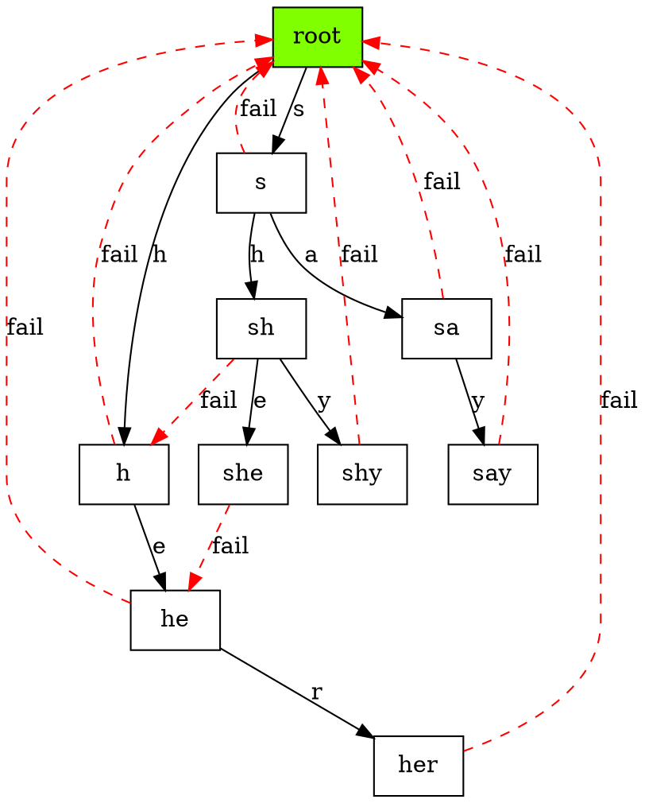

# AC-Automaton Multi-Pattern Searching Algorithm

[AC](https://en.wikipedia.org/wiki/Aho%E2%80%93Corasick_algorithm) is a
multi-pattern searching algorithm. For a given set of pattern strings $S$, it
pre-caculates a trie representing a state-machine for searching process. And
the time complexity is $O(\sum_{s \in S} |s|)$.

Here is an example of AC-automaton structure with 4 patterns (`she`, `shy`,
`say`, `her`):



## Implementation 

```c++
#include "trie.hpp"

using namespace std;

class ac_auto {

  public:

    struct ac_ext {

      trie<ac_ext>::node *fail;

      map<char, trie<ac_ext>::node*> fallback;

      string *pattern;

    };

    typedef trie<ac_ext>::node node;

  private:

    trie<ac_ext> dict;

  public:

    auto root() {

      return dict.root();
    }


    // Construct AC-automaton.
    ac_auto(const set<string> &patterns) {

      // 1. Insert all patterns into trie.
      for (const string &pattern : patterns) {

        dict[pattern].ext.pattern = new string(pattern);
      }

      // 2. Resolve root node.
      auto root = &dict[""];

      root->ext.fail = root;

      // 3. Initialize queues for BFS process.
      auto q_chr = queue<char>({ '\0' });
      auto q_ptr = queue<node*>({ root });

      // 4. BFS-loop.
      while (!q_chr.empty() && !q_ptr.empty()) {

        // 4.1. Pop node `p` suffixed with `c`.
        auto c = q_chr.front();
        auto p = q_ptr.front();

        q_chr.pop();
        q_ptr.pop();
        
        // 4.2. Find fail pointer for node `p`.
        if (p != root) {

          if (p->parent == root) {

            p->ext.fail = root;

          } else {

            auto q = p->parent->ext.fail;
            
            while (q != root && q->children.find(c) == q->children.end()) {

              q = q->ext.fail;
            }

            p->ext.fail = q->children.find(c) != q->children.end()
              ? q->children[c] : root;
          }
        }
        
        // 4.3. Expand all children of p.
        for (const auto &itr : p->children) {

          q_chr.push(itr.first);
          q_ptr.push(itr.second);
        }
      }
    }

    // Next state after accepting character `c`.
    static node *next(node *state, char c) {

      if (state->ext.fallback.find(c) == state->ext.fallback.end()) {

        while (
          state->ext.fail != state
            && state->children.find(c) == state->children.end()
        ) {

          state = state->ext.fail;
        }

        state->ext.fallback[c] =
          state->children.find(c) != state->children.end() ?
            state->children[c] : state;
      }

      return state->ext.fallback[c];
    }

    set<pair<int, string>> match(string search) {

      auto ret = set<pair<int, string>>();

      // Current state in ac-automaton.
      auto s = root();

      for (int pos = 0; pos < search.length(); pos++) {

        // Accept next character.
        s = next(s, search[pos]);

        // Iterate all suffixes of current state `s`, check if there are any
        // matched patterns.
        for (auto q = s; q != root(); q = q->ext.fail) {

          const string *pattern = q->ext.pattern;

          if (NULL != pattern) {

            ret.insert(pair<int, string>(pos - (*pattern).length() + 1,
                                         *pattern));
          }
        }
      }

      return ret;
    }

    node& operator[](const string &key) {

      return dict[key];
    }
};
```
