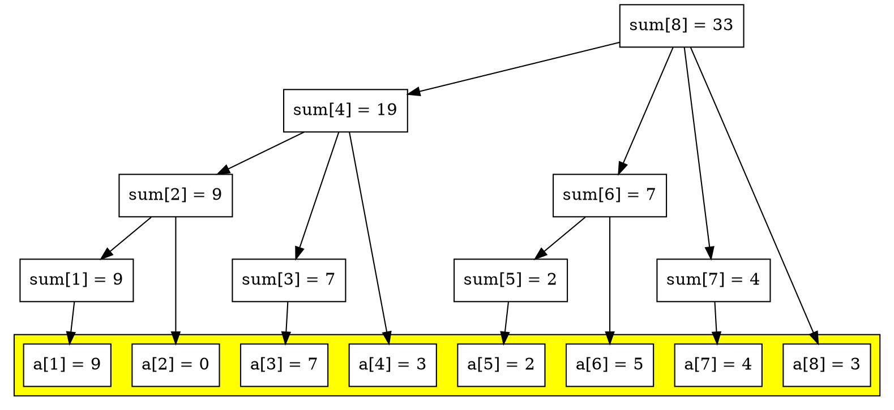

# Fenwick Tree

A [fenwick tree](https://en.wikipedia.org/wiki/Fenwick_tree) or binary indexed
tree is a kind of data structure used to maintain the preffix sums of an
ordered list of numbers.



The main concept of fenwick tree is $Lowbit$ function, which is the number of
which all bits are assgined to zero without the last $1$ in the given number's
binary representation. Each node $Sum_k$ in fenwick tree holds the sum of
$\sum_{i - lowbit(i) + 1}^{k} A_i$

In most programming languages, $lowbit$ can be implemented like this:

```c++
int lowbit(int x) {

  return x & (-x);
}
```
## Implementation

```c++
class bit {

  public:

    int *sum, size;

    bit(int size) {

      this->size = size;
      this->sum = new int[size + 1];

      for (int i = 0; i <= size; i++) {

        this->sum[i] = 0;
      }
    }

    void add(int pos, int value) {

      while (pos <= this->size) {

        sum[pos] += value;
        pos += (pos & (-pos));
      }
    }

    int query(int pos) {

      int result = 0;

      while (pos > 0) {

        result += sum[pos];
        pos -= (pos & (-pos));
      }

      return result;
    }
};

```

