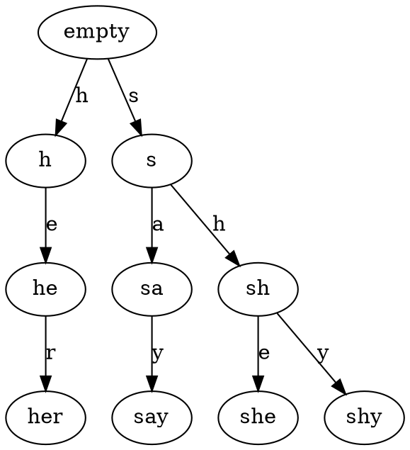

# Trie Data Structure

[Trie](https://en.wikipedia.org/wiki/Trie) is a kind of preffix search tree,
by which we can map strings to any data type. For any given string $s$, the
time complexity of seeking is $O(|s|)$.

Here is an example of trie structure with 4 strings (`her`, `say`, `she`, `shy`)
inserted.



## Implementation

```c++
#include <queue>
#include <set>
#include <map>
#include <string>

using namespace std;

template<typename T>
class trie {

  public:

    struct node {

      node *parent;
      
      map<char, node*> children;

      T ext;
    };

  private:
    
    node *_root = new node({ .parent = NULL });

  public:

    node *root() {

      return _root;
    }

    node& operator[](const string &key) {

      node *ptr = root();

      for (const char &c : key) {

        if (NULL == ptr->children[c]) {

          ptr->children[c] = new node({ .parent = ptr });
        }

        ptr = ptr->children[c];
      }

      return *ptr;
    }
};
```
