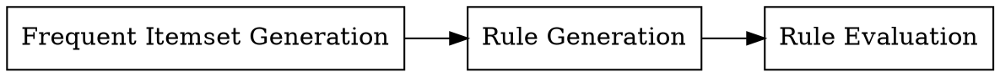
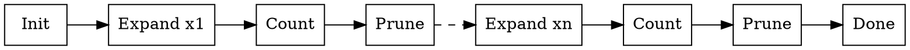

# Association Analysis and Apriori Algorithm

Association analysis is one of the common parts of unsupervised machine learning.
In association analysis, our goal is briefly to find things happening together.

Look at this table of people puchasing items:

| ID | Items |
|---:|:----------:|
|  1 | Milk, Bread |
|  2 | Butter |
|  3 | Beer, Tissue |
|  4 | Milk, Bread, Butter |
|  5 | Bread |

You could probably find that milk and butter are always purchased together.

$$
\{Milk\} \to \{\text{Butter}\}
$$

This is what we are tring to do through associate rule mining: exploring a set
of data (transactions) and output a kind of descriptive result (association rules).

## Basic Concepts

Here are some basic concepts of associate rule mining:

 * **Item**: a label which appears in some records, such as `Milk`, `Bread`,... 
 * **Itemset**: a collection of items, like: $\{\text{Milk}, \text{Bread}\}$.
 * **Association rule**: an ordered pair of itemsets, like: $\{\text{Milk}\} \to \{\text{Butter}\}$

For given transactions $T = \{ t \mid \text{t is an itemset} \}$ with $n$ distinct items, we define:

 * **Support count**: $\sigma(x) = \lvert \{t \in T \mid \text{t property contains x}\} \rvert$,
   where $x$ is a itemset.

And two metrics to evalute how significant a rule $r: x \to y$ is:

  * **Support**: $s(x \to y) = \frac{\sigma(x \cup y)}{\lvert T \rvert}$
  * **Confidence**: $c(x \to y) = \frac{\sigma(x \cup y)}{\sigma(x)}$

Then, an **Association Rule Mining Task** could be defined as:

> For given transactions $T$ and thresholds $minSup$ and $minConf$, find a set of rules:
>  * $R = \{x \to y \mid x \cap y = \empty \land s(x \to y) \geq \text{minSup} \land c(x \to y) \geq \text{minConf} \}$

There are
$ 2^{n} \times 2^{n}$ possibilities of pair $x$ and $y$. Simply enumerating
all possible rules could be expotential time complexity and it doesn't work
with a growing size of transactions.

As it's easy to know that:

  * $\forall r:x \to y, \text{ if } s(x \to y) \geq \text{minSup}, \frac{\sigma(x \cup y)}{\lvert T \rvert} \geq \text{minSup}$

For such kind of $a = x \cup y \mid \frac{\sigma(a)}{\lvert T \rvert} \geq \text{minSup}$,
we say $a$ is a **frequent itemset**. And it could be better if we calculate all
posible frequent itemsets first.

Followed by this idea, the process of association rule mining could be divided
into two steps:
  
  * Find a collection of frequent itemsets $I = \{ a \mid \frac{\sigma(a)}{\lvert T \rvert} \geq \text{minSup}\}$
  * For each $a \in I$, find all rules $\{r : x \to (a - x) \mid c(x \to y) \geq \text{minConf}\}$

## Frequent Itemset Generation

There are many ways to calculate frequent itemsets. One of them is called
[Apriori algorithm](https://en.wikipedia.org/wiki/Apriori_algorithm).

This algorithm is based on a pretty simple idea:

  * $\forall x \subseteq y, \sigma(x) \geq \sigma(y)$, where $x$, $y$ are two itemsets

So, if $x$ isn't a frequent itemset, any super set of $x$ could not be a frequent
item set. [Apriori algorithm](https://en.wikipedia.org/wiki/Apriori_algorithm)
uses this as prune strategy.

This algorithm starts with an empty set candidate frequent itemsets. Every time,
it expands one more item into candidate sets. And prune impossible candidates
immediately.

### Flow Diagram

### Pseudo code

$$
\begin{aligned}
  & Apriori(T, \text{minSup}) \\
  & \quad C \leftarrow \empty \\
  & \quad \mathtt{for} \ x \in \{\text{distinct items of T}\} \\
  & \quad \quad C \leftarrow \{x\} \cup I \cup \{ {x} \cup a \mid a \in I \}\\
  & \quad \quad C \leftarrow \{ a \mid a \in C \land \frac{\sigma(x)}{\lvert T \rvert}) \geq \text{minSup} \} \\
  & \quad \mathtt{return} \ C
\end{aligned}
$$

## Rule Generation

Now, let's turn to the part of rule generation.

As it's easy to know:

  * $ \forall x, y \supseteq z, c(x \to y) = \frac{\sigma(x)}{\sigma(y)} \geq \frac{\sigma(x \cup z)}{\sigma(y - z)} \geq c(x \cap z, y - z) $

So, for every $r : x \to y$, if $c(x \to y) \geq \text{minConf}$, moving more
items from $y$ to $x$ doesn't  change the requirement of $\text{minConf}$.

Using this as a prune strategy, we can get a simple rule generation algorithm.

### Pseudo Code

$$
\begin{aligned}
  & RuleGenerate(I) \\
  & \quad R \leftarrow \empty \\
  & \quad C \leftarrow \{(\empty \to a) \mid a \in I\} \\
  & \quad \mathtt{while} \ \lvert C \rvert > 0 \\
  & \quad \quad C_{\text{next}} = \empty \\
  & \quad \quad \mathtt{for} \ c: x \to y \in C \\
  & \quad \quad \quad \mathtt{for} \ z \in y \\
  & \quad \quad \quad \quad x_{\text{next}} = x \cup \{z\} \\
  & \quad \quad \quad \quad y_{\text{next}} = y - \{z\} \\
  & \quad \quad \quad \quad \mathtt{if} \ c(x_{\text{next}} \to y_{\text{next}}) \geq \text{minConf} \\
  & \quad \quad \quad \quad \quad R \leftarrow R \cup \{x_{\text{next}} \to y_{\text{next}}\} \\
  & \quad \quad \quad \quad \mathtt{else}\\
  & \quad \quad \quad \quad \quad C_{\text{next}} \leftarrow C_{\text{next}} \cup \{x_{\text{next}} \to y_{\text{next}}\} \\
  & \quad \quad C = C_{\text{next}}\\
  & \quad \mathtt{return} \ R
\end{aligned}
$$

## Rule Evaluation

Assogication rule mining could produce a huge number of rules. But not all of
them could be meaningful. Mostly we need more metrics to evalute generate rueles,
which are called **interestingness measure**.

### Drawback of Confidence

Look at this example table of frequency:

$$
\begin{array}{c|ccc}
 & y & \overline{y} \\
 \hline
 x & 15 & 5 & 20 \\
 \overline{x} & 75 & 5 & 80 \\
 & 90 & 10 \\
\end{array}
$$

As we know,

$$
\begin{aligned}
  c(x \to y) & = \frac{\sigma(x \cup y)}{\sigma(x)} \\
             & = \frac{15}{20} \\
             & = 0.75
\end{aligned}
$$

since $0.75$ is sufficienty high, rule $x \to y$ seems to be a pretty significant
rule.

But really? $P(y) = \frac{90}{100} = 0.9> 0.75$, which means $X$ actually reduces
the possibility of $Y$.

### Statistical Dependence

For any $x$ and $y$:

  * If $P(x, y) > P(x) \times P(y)$, then we say $x$ and $y$ are positive related.
  * If $P(x, y) < P(x) \times P(y)$, then we say $x$ and $y$ are negative related.

### Interestingness Measure

There are actually manu ways to measure interestingness of association rules,
but based on what we've talked before, one simple measure could be
([$\phi\text{-coefficient}$](https://en.wikipedia.org/wiki/Phi_coefficient)):

$$
  \phi\text{-coefficient} = \frac{P(x, y) - P(x)P(y)}{P(x)[1-P(x)]P(y)[1-P(y)]}
$$
