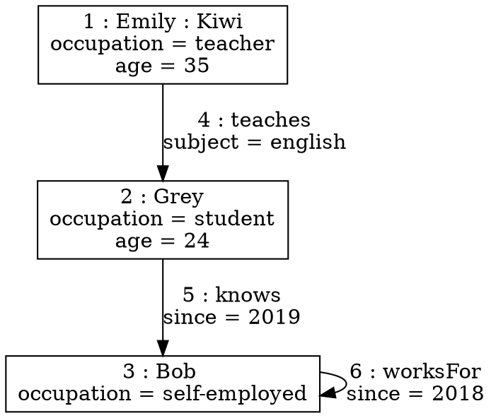

# Graph Data Model

## PGM - Property Graph Model

Property graph model is a kind of formal definition of graph data. In this
model, data is reprensented as a directed, attributed multi-graph.

Let's say:

* $O$ is a set of objects.
* $K$ is a set of property keys.
* $L$ is a set of labels.
* $N$ is a set of values.

Then a property graph is a structure $(V, E, \eta, \lambda, \mu)$ where

* $V \subseteq O$ is a set of objects, called vertices.
* $E \subseteq O$ is a set of edges, called edges.
* $\eta : E \to V \times V$ is a function assigning each edge to an ordered
pair of vertices.
* $\lambda : V \cup E \to P(L)$ is a function assigning each object to a set
of labels.
* $\mu : (V \cup E) \times K \to N)$ is a function assigning each object and
key to a value.

### Example.

Here is an example property graph of three people and their relations:

For this example:

* $V = \{1, 2, 3\}$
* $E = \{4, 5, 6\}$
* $\eta = E \to V \times V$ is:

  | object | vertices |
  |:------:|:--------:|
  | 4 | 1, 2 |
  | 5 | 2, 3 |
  | 6 | 3, 3 |

* $\lambda = V \cup E \to P(L)$ is:

  | object | labels |
  |:------:|:------:|
  | 1      | Emily, Kiwi |
  | 2      | Grey |
  | 3      | Bog |
  | 4      | teaches |
  | 5      | knows |
  | 6      | worksFor |

* $\mu = (V \cup E) \times K \to N$ is:

  | object | key | value |
  |:------:|:---:|:-----:|
  | 1 | occupation | teacher |
  | 1 | age | 35 |
  | 2 | occupation | student |
  | 2 | age | 25 |
  | 3 | occupation | self-employed |
  | 4 | subject | English |
  | 5 | since | 2019 |
  | 6 | since | 2018 |

## OPPGM - Objectified Paths Property Graph Model

Based on PGM, if we turn paths into objects, we get objectified
paths property graph model (OPPGM).

An OPPGM is a structure $(V, E, P, \eta, \delta, \lambda, \mu)$ where

* $V \subseteq O$ is a set of objects, called vertices.
* $E \subseteq O$ is a set of objects, called edges.
* $P \subseteq O$ is a set of objects, called paths.
* $\eta : E \to V \times V$ is a function assigning each edge to a pair of
  vertices.
* $\delta : P \to \cup_{n >= 0} E^n$ is a function assgining each path to a
  sequence of edges.
* $\lambda : V \cup E \cup P \to P(L)$ is a function assigning each object to
  a set of labels.
* $\mu : (V \cup E \cup P) \times K \to N$ is a function assigning each object
  and key to a value.

## OSPGM - Objectified Subgraph PGM

Based on PGM, if we turn subgraphs into objects, we get objectified subgraph
PGM (OSPGM).

An OSPGM is a structure $(V, E, G, \eta, \gamma, \lambda, \mu)$ where

* $V \subseteq O$ is a set of objects, called vertices.
* $E \subseteq O$ is a set of objects, called edges.
* $G \subseteq O$ is a set of objects, called subgraphs.
* $\eta : E \to V \times V$ is a function assigning each edge to a pair of
  vertices.
* $\gamma : G \to P(V) \times P(E)$ is a function assigning every subgraph to
  a pair of vetex set and edge set.
* $\lambda : V \cup E \cup G \to P(L)$ is a function assigning each object to
  a set of labels.
* $\mu : (V \cup E \cup G) \times K \to N$ is a function assigning each object
  and key to a value.

## HVPGM - Hypervetex PGM

Based on PGM, if we turn subgraphs into vertices, we get hypervetex PGM (HVPGM).

An HVPGM is a structure $(V, E, \eta, \gamma, \lambda, \mu)$ where

* $V \subseteq O$ is a set of objects, called vertices.
* $E \subseteq O$ is a set of objects, called edges.
* $\eta : E \to V \times V$ is a function assigning each edge to a pair of
  vertices.
* $\gamma : V \to P(V) \times P(E)$ is a function assigning every subgraph to
  a pair of vetex set and edge set.
* $\lambda : V \cup E \to P(L)$ is a function assigning each object to
  a set of labels.
* $\mu : (V \cup E) \times K \to N$ is a function assigning each object
  and key to a value.

## HEPGM - Hyper Edge Property Graph Model

Based on HVPGM, if a edge can link to any non-empty sequence of vertices without
repetitions (not only 2 vertices), we get hyper edge property graph model
(HEPGM).

Ans HEPGM is a structure $(V, E, \eta, \gamma, \lambda, \mu)$ where

* $V \subseteq O$ is a set of objects, called vertices.
* $E \subseteq O$ is a set of objects, called edges.
* $\eta : E \to \cup_{X \in P(V) - \empty} {[\pi(1),...,\pi(|X|)]}$ is a
function assigning each edge to a non-empty sequence of vertices without
repetitions.

* $\gamma : V \to P(V) \times P(E)$ is a function assigning every subgraph to
  a pair of vetex set and edge set.
* $\lambda : V \cup E \to P(L)$ is a function assigning each object to
  a set of labels.
* $\mu : (V \cup E) \times K \to N$ is a function assigning each object
  and key to a value.
