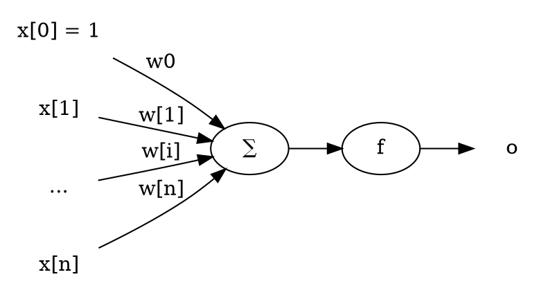
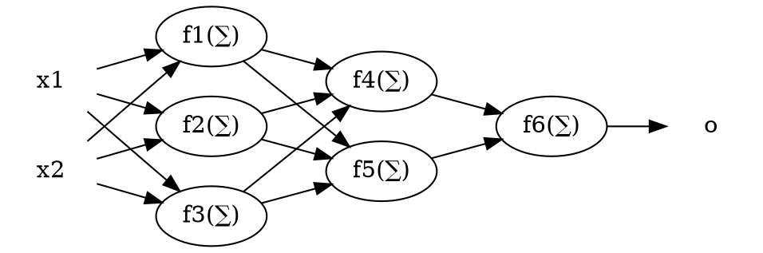

# Multi-Layer Perceptron and Back-Propagation Algorithm

## Perceptron

In machine learning, perceptron is a binary classifier, which calculates a
linear combination and outputs `1` or `-1`.

The takes an vector $X = (x_1 \cdots x_n)$ as the input, and calculates
$ o = f(\sum_{i = 0}^n w_i x_i) $, where $f$ is a **threshold function**.

$$
f(x) = \begin{cases}
  +1 & x > 0 \\
  -1 & \text{otherwise}.
\end{cases}
$$

Another vector $W = (w_0 \cdots x_n)$ is the parameters. For any linearly
separable problems, we can always find a suitable parameter $W$ to make the
perceptron works.

## Gradient Descent

Gradient descent is the key of how to find suitable parameters $W$ for the
perceptron to solve a specific problem.

For given multivariable function $f$, the gradient $\nabla f$ is a
vector-valued function and the result includes all partial derivatives of $f$
at current point.

$$
\nabla f = (
  \frac{\partial F}{\partial x_0}
  \cdots \frac{\partial F}{\partial x_n} 
)
$$

Let's say $ \gamma $ is a small enough number. For any $a$ and
$b = a - \gamma \nabla F(a)$, we have: $F(b) \leq F(a)$.

## Perceptron Learning Algorithm

For a given trainning instance $X = (x_1 \cdots x_n)$ and the classification 
$ t \in \{-1, 1 \}$.

Let's say the current parameter is $W = (w_0 \cdots w_n)$.

Using the current state of the perceptron, you can calculate a result:

  * $y = \sum_{i = 0}^n w_i x_i$
  * $o = f(y) \in \{ -1, 1 \}$

If $t = o$, that means the perceptron already works well for the given
instance. Or, we've already knew that whether we should make the calculated $y$
bigger or smaller.

Since $ \nabla y(w_0 \cdots w_n) = (x_0 \cdots x_n) $,
  
  * If $o = -1$, then $y$ is expected to be greater and we can replace $w_i$
    with $\overline{w_i} = w_i + \gamma x_i$.

  * If $o = +1$, then $y$ is expected to be smaller and we can replace $w_i$
    with $\overline{w_i} = w_i - \gamma x_i$.

In general, we can always replace $w_i$ with
$\overline{w_i} = w_i + \gamma (t - o) x_i$ to make the perceptron better.

## Multi-Layer Perceptron

The single perceptron can only solve linearly separable problems. To deal with
more complicated classification problems, we have multi-layer perceptron.

The basic idea of multi-layer perception is just stacking a sort of perceptrons
and make it as a network. For example, in the case showing above:

  * $x_1$ and $x_2$ are called input layer.
  * $(f_1, f_2, f_3)$ and $(f_4, f_5)$ are two hidden layers.
  * $f6$ is called output layer.
  * In each directed edge, there is a parameter $w_{i, j}$ as familiar as the
    single perceptron.

## Back-Propagation Algorithm

In multi-layer perceptron, we use the same gradient decent strategy to update
parameters, which is called **backpropagation** algorithm. And there are two
steps:

  * Familiar with $\Delta = t - o$ in perceptron learning algorithm, it
    reversely calculates the $\Delta f$ for each perceptron.

   * Then, it uses the same strategy to update $\overline{w}$ for each edge.

