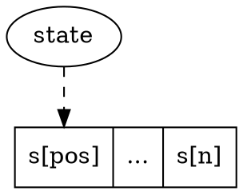

# Leet Code Weekly Contest 182

## 1. [Find Lucky Integer in an Array](https://leetcode.com/contest/weekly-contest-182/problems/find-lucky-integer-in-an-array/)

$O(n)$, just show the code.

```c++
class Solution {
public:
    int findLucky(vector<int>& arr) {
        
        int f[501];
        
        for (int i = 1; i <= 500; i++) {
            
            f[i] = 0;
        }
        
        for (int i = 0; i < arr.size(); i++) {
            
            f[arr[i]]++;
        }
        
        int ans = -1;
        
        for (int i = 1; i <= 500; i++) {
            
            if (f[i] == i && i > ans) {
                
                ans = i;
            }
        }
        
        return ans;
    }
};
```

## 2. [Count Number of Teams](https://leetcode.com/contest/weekly-contest-182/problems/count-number-of-teams/)

$O(n^3)$, simple.

```c++
class Solution {
public:
    int numTeams(vector<int>& rating) {
        
        int ans = 0, len = rating.size();
        
        for (int i = 0; i < len; i++) {
            
            for (int j = i + 1; j < len; j++) {
                
                for (int k = j + 1; k < len; k++) {
                    
                    if ( (rating[i] < rating[j] && rating[j] < rating[k]) || (rating[i] > rating[j] && rating[j] > rating[k]) ) {
                        
                        ans++;
                    }
                }
            }
        }
        
        return ans;
    }
};
```

## 3. [Design Underground System](https://leetcode.com/contest/weekly-contest-182/problems/design-underground-system/)

$O(n)$, any kind of map or hash-table works for this problem.

```c++
class UndergroundSystem {
public:
    struct check_in_record {
        
        string stationName;
        
        long t;
    };
    
    map<int, check_in_record*> status;
        
    map<string, long> count;
    map<string, long> total;
    
    UndergroundSystem() {
        
        status = map<int, check_in_record*>();
        
        count = map<string, long>();
        total = map<string, long>();
    }
    
    void checkIn(int id, string stationName, int t) {
        
        
        status[id] = new check_in_record();
        status[id]->stationName = stationName;
        status[id]->t = t;
    }
    
    void checkOut(int id, string stationName, int t) {
        
        auto record = status[id];
        
        string key = record->stationName + "," + stationName;
        
        count[key]++;
        total[key] += (t - record->t);
    }
    
    double getAverageTime(string startStation, string endStation) {
        
        string key = startStation + "," + endStation;
        
        return 1.0 * total[key] / count[key];
    }
};
```

## 4. [Find All Good Strings](https://leetcode.com/contest/weekly-contest-182/problems/find-all-good-strings/)

[DP](https://en.wikipedia.org/wiki/Dynamic_programming) & [AC](https://en.wikipedia.org/wiki/Aho%E2%80%93Corasick_algorithm).

### 4.1 Simplify to answer $H(s, evil)$

Let's say $H(s, evil)$ represents **the number of strings which the length is as
same as `s`, less or equal to `s` and do not contain sub-string `evil`**. Then
the answer for this question can be simplified as:

$$
Answer=\begin{cases}
H(s_2, evil) - H(s_1, evil) & s_1 \ contains \ evil\\
H(s_2, evil) - H(s_1, evil) + 1 & s_1 \ does \ not \ contain \ evil\\
\end{cases}
$$

### 4.2 Construct ac-automaton for the pattern `evil`.

Let's say $S$ represents all the states in the ac-automaton of `evil`.

And by retrieving the fail-back chain of each state, we can get wheather each
state represents a matched state or not:

Let's say $isMatched(s) \in \{True, False\}$ represents wheather a state is
matched or not.

### 4.3 Dynamic programming for $H(s, evil)$

Let's say:

* $G(pos, state)$ represents the number of suffix strings starting from `pos`
after `state` which don't contain evil.

* $F(pos, state)$ represents the number of suffix strings starting from `pos`
after `state` which don't contain evil, less or equal than `state` and they don't
contain evil.



Then:

$$
G(pos, state)=\begin{cases}
  0 & isMatched(state) = True\\
  1 & isMatched(state) = False \land pos = n\\
  \sum_{c='a'}^{'z'} G(pos + 1, next(state, c)) & isMatched(state) = False \land pos < n\\
\end{cases}
$$

$$
F(pos, state)=\begin{cases}
  0 & isMatched(state) = True\\
  1 & isMatched(state) = False \land pos = n\\
  F(pos +1, next(state, s_{pos + 1})) + \sum_{c = 'a'}^{s_{pos + 1} - 1} G(pos + 1, next(state, c)) & isMatched(state) = False \land pos<n\\
\end{cases}
$$

And the answer of $H(s, evil)$ is actually $F(0, root)$.

```c++
#include <queue>
#include <set>
#include <map>
#include <string>

using namespace std;

template<typename T>
class trie {

  public:

    struct node {

      node *parent;
      
      map<char, node*> children;

      T ext;
    };

  private:
    
    node *_root = new node({ .parent = NULL });

  public:

    node *root() {

      return _root;
    }

    node& operator[](const string &key) {

      node *ptr = root();

      for (const char &c : key) {

        if (ptr->children.find(c) == ptr->children.end()) {

          ptr->children[c] = new node({ .parent = ptr });
        }

        ptr = ptr->children[c];
      }

      return *ptr;
    }
};


class ac_auto {

  public:

    struct ac_ext {

      trie<ac_ext>::node *fail;

      map<char, trie<ac_ext>::node*> fallback;

      string *pattern;

    };

    typedef trie<ac_ext>::node node;

  private:

    trie<ac_ext> dict;

  public:

    auto root() {

      return dict.root();
    }


    // Construct AC-automaton.
    ac_auto(const set<string> &patterns) {

      // 1. Insert all patterns into trie.
      for (const string &pattern : patterns) {

        dict[pattern].ext.pattern = new string(pattern);
      }

      // 2. Resolve root node.
      auto root = &dict[""];

      root->ext.fail = root;

      // 3. Initialize queues for BFS process.
      auto q_chr = queue<char>({ '\0' });
      auto q_ptr = queue<node*>({ root });

      // 4. BFS-loop.
      while (!q_chr.empty() && !q_ptr.empty()) {

        // 4.1. Pop node `p` suffixed with `c`.
        auto c = q_chr.front();
        auto p = q_ptr.front();

        q_chr.pop();
        q_ptr.pop();
        
        // 4.2. Find fail pointer for node `p`.
        if (p != root) {

          if (p->parent == root) {

            p->ext.fail = root;

          } else {

            auto q = p->parent->ext.fail;
            
            while (q != root && q->children.find(c) == q->children.end()) {

              q = q->ext.fail;
            }

            p->ext.fail = q->children.find(c) != q->children.end()
              ? q->children[c] : root;
          }
        }
        
        // 4.3. Expand all children of p.
        for (const auto &itr : p->children) {

          q_chr.push(itr.first);
          q_ptr.push(itr.second);
        }
      }
    }

    // Next state after accepting character `c`.
    static node *next(node *state, char c) {

      if (state->ext.fallback.find(c) == state->ext.fallback.end()) {

        while (
          state->ext.fail != state
            && state->children.find(c) == state->children.end()
        ) {

          state = state->ext.fail;
        }

        state->ext.fallback[c] =
          state->children.find(c) != state->children.end() ?
            state->children[c] : state;
      }

      return state->ext.fallback[c];
    }

    set<pair<int, string>> match(string search) {

      auto ret = set<pair<int, string>>();

      // Current state in ac-automaton.
      auto s = root();

      for (int pos = 0; pos < search.length(); pos++) {

        // Accept next character.
        s = next(s, search[pos]);

        // Iterate all suffixes of current state `s`, check if there are any
        // matched patterns.
        for (auto q = s; q != root(); q = q->ext.fail) {

          const string *pattern = q->ext.pattern;

          if (NULL != pattern) {

            ret.insert(pair<int, string>(pos - (*pattern).length() + 1,
                                         *pattern));
          }
        }
      }

      return ret;
    }

    node& operator[](const string &key) {

      return dict[key];
    }
};


typedef ac_auto::node node;

const long MOD = 1000000007;

class Solution {

  public:

    int dp(int n, string s, node *root, vector<node*> states) {

      // Next.
      int next[states.size()][26];

      for (int i = 0; i < states.size(); i++) {

        auto state = states[i];

        for (char c = 'a'; c <= 'z'; c++) {

          auto next_state = ac_auto::next(state, c);

          for (int j = 0; j < states.size(); j++) {

            if (states[j] == next_state) {

              next[i][c - 'a'] = j;

              break;
            }
          }
        }
      }
      
      int f[n + 1][states.size()], g[n + 1][states.size()];

      for (int pos = n; pos >= 0; pos--) {

        for (int j = 0; j < states.size(); j++) {

          auto state = states[j];

          if (NULL != state->ext.pattern) {

            g[pos][j] = 0;
            f[pos][j] = 0;

          } else if (pos == n) {

            g[pos][j] = 1;
            f[pos][j] = 1;

          } else {

            g[pos][j] = 0;

            for (char c = 'a'; c <= 'z'; c++) {

              g[pos][j] = (g[pos][j] + g[pos + 1][next[j][c - 'a']]) % MOD;
            }

            f[pos][j] = f[pos + 1][next[j][s[pos] - 'a']];

            for (char c = 'a'; c < s[pos]; c++) {

              f[pos][j] = (f[pos][j] + g[pos + 1][next[j][c - 'a']]) % MOD;
            }
          }

        }
      }

      return f[0][0];
    }

    int findGoodStrings(int n, string s1, string s2, string evil) {
  
      clock_t t0 = clock();

      if (s1 > s2) {

        return 0;
      }

      // Construct ac-automaton.
      auto ac = ac_auto(set<string>({ evil }));

      // BFS, resolve all states of ac-automaton and wheather every state
      // is a matched state.
      auto states = vector<node*>();

      for (auto q = queue<node*>({ ac.root() }); !q.empty(); q.pop()) {

        auto state = q.front();

        for (const auto &itr : state->children) {

          q.push(itr.second);
        }

        states.push_back(state);
      }

      // DP.
      int ans = dp(n, s2, ac.root(), states) - dp(n, s1, ac.root(), states);

      // s1 doesn't contain evil.
      if (s1.find(evil, 0) == string::npos) {

        ans++;
      }

      return (ans + MOD) % MOD;
    }
};
```
