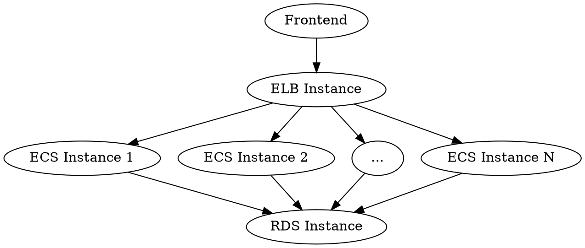

# Deploy Reproducible Infrastructure on AWS with Terraform

[Terraform](https://www.terraform.io/) is an open-source infrastructure as code software tool created by HashiCorp. In this article, I'm going to introduce how to deploy a scalable .NET Web Api Service on AWS with Terraform.

## Prerequisites.

* An [AWS](https://aws.amazon.com/) account.
* The [AWS CLI](https://aws.amazon.com/cli/) installed.
* Your AWS credentials configured locally.
* The [Terraform CLI](https://www.terraform.io/) installed.

## Overview.

Basically, I want to deploy a .NET Web Api Service called [comments-api](https://github.com/aguang-xyz/comments-api) on AWS. It will provide REST APIs to manage the comments of [my blog](https://aguang.xyz/). It has only one dependency: a MySQL database server. To make it scalable to face high concurrency scenario, we plan to have an [Elastic Load Balancer \(ELB\)](https://aws.amazon.com/elasticloadbalancing) to load balance HTTP requests to multiple backend [Elastic Container Services (ECS)](https://aws.amazon.com/ecs/). And we will host a [Relational Database Service (RDS)](https://aws.amazon.com/rds/) as the production MySQL database server.

The digram above shows what our infrastructure will look like:



The terraform configuration for the deployment on AWS will be stored in the subfolder `deploy/aws`.

```
.
├── deploy
│   └── aws
│        ├── keys
│        │   ├── ec2
│        │   └── ec2.pub
│        ├── scripts
│        │   ├── build-project
│        │   ├── execute-migrations
│        │   └── generate-ssh-keys
│        ├── main.tf
│        ├── outputs.tf
│        └── variables.tf
├── src
└── test
```

With in this folder:

* `keys/ec2` and `keys/ec2.pub` is the ssh key which will be used to connect with ECS instances.
* `scripts` folder contains several scripts to build .NET Core project, do database migrations and generate ssh key pairs.
* `main.tf` contians the most definition of our infrastructure.
* `outputs.tf` defines the result of a deployment (such as: ELB public address, public ips of the ECS instances and the connection string of the RDS instance).
* `variables.tf` defines some input parameters (such as: AWS region, ECS image id and the number of Instances).

## Define input variables.

First, let's go into the file `variables.tf`. In terraform, we can use keyword `variable` to define serveral [input variables](https://www.terraform.io/docs/configuration/variables.html). If there is no default value of some parameter, terraform will let us to input the value during the apply state. And we can override the default values by command line parameters such as `-var="name=value"`.

**variables.tf**:

```terraform
variable "aws_region" {
  default = "ap-southeast-1"
}

variable "aws_amis" {
  default = {
    "ap-southeast-1" = "ami-0b44582c8c5b24a49"
  }
}

variable "aws_instances" {
  default = 2
}

variable "app_environment" {
  default = "Development"
}
```

Basically, we defined four input variables here:

* `aws_region`: The region we want to deploy our infrastructure, `ap-southeast-1` indicates the Singapore region.
* `aws_amis`: ECS image id, `ami-0b44582c8c5b24a49` indicates `Ubuntu 18.04 LTS (x64)`. **HINT: One thing we should know is that the same image have different ids in different regions**.
* `aws_instances`: The number of ECS instances we want to have.
* `app_environment`: The [environment in ASP.NET Core](https://docs.microsoft.com/en-us/aspnet/core/fundamentals/environments?view=aspnetcore-3.1).

## Import providers. 

Now we start to focus on the `main.tf` which includes the most import part.

At the begining, we import serveral [providers](https://www.terraform.io/docs/providers/index.html). A provider is responsible for understanding API interactions and exposing resources. We have four required providers:

* [Null Provider](https://registry.terraform.io/providers/hashicorp/null/latest/docs): which will be used to define virtual resources. 
* [Random Provider](https://registry.terraform.io/providers/hashicorp/random/latest/docs): which will be used to generate random passwords of the database.
* [Local Provider](https://registry.terraform.io/providers/hashicorp/local/latest/docs): which will be used to execute local scripts.
* [AWS Provider](https://registry.terraform.io/providers/hashicorp/aws/latest/docs): which exposes the ability to manage AWS resources.

```
terraform {
  required_providers {
    null = {
      source  = "hashicorp/null"
      version = "~> 2.1.2"
    }

    random = {
      source = "hashicorp/random"
      version = "~> 2.3.0"
    }

    local = {
      source = "hashicorp/local"
      version = "~> 1.4.0"
    }

    aws = {
      source  = "hashicorp/aws"
      version = "~> 2.70"
    }
  }
}
```

## Declare the AWS region.

And then we declare the region that we plan to use.

```
provider "aws" {
  region  = var.aws_region
}
```

## Deploy a RDS instance.

To setup the RDS instance, first we randomly generate a password for the database.

```
# Randomly generate a string as the RDS password.
resource "random_string" "rds_password" {
  length = 16
}
```

And then, we declare a [security group](https://docs.aws.amazon.com/vpc/latest/userguide/VPC_SecurityGroups.html) for the RDS instance. It will allow incoming MySQL traffic (TCP, port: 3306).

```
# Create a security group for the RDS instance.
resource "aws_security_group" "rds" {
  description = "Allow MySQL traffic"

  ingress {
    description = "MySQL"
    from_port   = 3306
    to_port     = 3306
    protocol    = "tcp"
    cidr_blocks = ["0.0.0.0/0"]
  }

  egress {
    from_port   = 0
    to_port     = 0
    protocol    = "-1"
    cidr_blocks = ["0.0.0.0/0"]
  }
}
```

And finally, we declare the RDS instance (MySQL 5.7, storage 20GB\).

```
resource "aws_db_instance" "rds" {
  allocated_storage    = 20
  storage_type         = "gp2"
  engine               = "mysql"
  engine_version       = "5.7"
  instance_class       = "db.t2.micro"
  name                 = "comments"
  username             = "root"
  password             = random_string.rds_password.result
  parameter_group_name = "default.mysql5.7"

  skip_final_snapshot  = true
  publicly_accessible  = true

	vpc_security_group_ids = [
		aws_security_group.rds.id
	]
}
```

## Build ASP.NET project.

Before deploy ECS instances, we should prepare the [`appsettings.{Environment}.json`](https://docs.microsoft.com/en-us/aspnet/core/fundamentals/configuration/?view=aspnetcore-3.1) and compile the source code to generate executable binary.


```
# Generate appsettings.Production.json and compile the source project.
resource "null_resource" "build_project" {
  provisioner "local-exec" {
    command = "./scripts/build-project"

    environment = {
      APP_ENVIRONMENT = var.app_environment
      RDS_HOST        = aws_db_instance.rds.address
      RDS_PORT        = aws_db_instance.rds.port
      RDS_DATABASE    = aws_db_instance.rds.name
      RDS_USERNAME    = aws_db_instance.rds.username
      RDS_PASSWORD    = aws_db_instance.rds.password
    }
  }
}
```

**scripts/build-project**:

```bash
#!/usr/bin/env bash

$(cat <<EOF > ../../src/appsettings.${APP_ENVIRONMENT}.json
{
  "DbContext": {
    "Server": "${RDS_HOST}",
    "Database": "${RDS_DATABASE}",
    "Port": "${RDS_PORT}",
    "User": "${RDS_USERNAME}",
    "Password": "${RDS_PASSWORD}"
  }
}
EOF
)

dotnet publish ../../src -c ${APP_ENVIRONMENT}

```

## Execute database migrations.

After the [`appsettings.{Environment}.json`](https://docs.microsoft.com/en-us/aspnet/core/fundamentals/configuration/?view=aspnetcore-3.1) has been ready, we should execute the migrations to make sure the structure of database is up-to-date.

```
# Execute database migrations.
resource "null_resource" "execute_migrations" {
  provisioner "local-exec" {
    command = "./scripts/execute-migrations"

    environment = {
      APP_ENVIRONMENT = var.app_environment
    }
  }

  depends_on = [
    null_resource.build_project
  ]
}
```

**scripts/execute-migrations**:

```bash
#!/usr/bin/env bash

dotnet ef database update --project ../../src/CommentsApi.csproj --configuration ${APP_ENVIRONMENT}
```

## Deploy EC2 instances.

After the source code has been compiled, we should start to deploy the application to EC2 instances. First, we should generate SSH key pairs. The following configuration will generate SSH key pair `keys/ec2` and `keys/ec2.pub` if they do not exist.

```
# Generate SSH keys locally.
resource "null_resource" "generate_ssh_keys" {
  provisioner "local-exec" {
    command = "./scripts/generate-ssh-keys"
  }
}

# The local file "keys/ec2".
data "local_file" "ec2_private_key" {
  filename   = "./keys/ec2"
  depends_on = [null_resource.generate_ssh_keys]
}

# The local file "keys/ec2.pub".
data "local_file" "ec2_public_key" {
  filename   = "./keys/ec2.pub"
  depends_on = [null_resource.generate_ssh_keys]
}

# Create the AWS SSH key pair for EC2 instances.
resource "aws_key_pair" "ec2" {
  key_name   = "ec2"
  public_key = data.local_file.ec2_public_key.content
}
```

**scripts/generate-ssh-keys**:

```bash
#!/usr/bin/env bash

if [ ! -f ./keys/ec2 ]
then
  ssh-keygen -t rsa -P '' -f ./keys/ec2
fi
```

Then, we declare a security group for EC2 instances which allow incoming SSH traffic and HTTP traffic.

```
# Create a security group for EC2 instances.
resource "aws_security_group" "ec2" {
  description = "Allow HTTP, HTTPS and SSH traffic"

  ingress {
    description = "SSH"
    from_port   = 22
    to_port     = 22
    protocol    = "tcp"
    cidr_blocks = ["0.0.0.0/0"]
  }

  ingress {
    description = "HTTP"
    from_port   = 8080
    to_port     = 8080
    protocol    = "tcp"
    cidr_blocks = ["0.0.0.0/0"]
  }

  egress {
    from_port   = 0
    to_port     = 0
    protocol    = "-1"
    cidr_blocks = ["0.0.0.0/0"]
  }
}
```

After that, we can deploy EC2 instances. Here, we use `file` provisioner to async binaries into EC2 instances. And we use `remote-exec` provisioner to install required dependencies and start the service process.


```
# Create EC2 instances (with nginx installed).
resource "aws_instance" "ec2" {
  count         = var.aws_instances
  key_name      = aws_key_pair.ec2.key_name
  ami           = var.aws_amis[var.aws_region]
  instance_type = "t2.micro"

	vpc_security_group_ids = [
		aws_security_group.ec2.id
	]

	connection {
    type        = "ssh"
    user        = "ubuntu"
    private_key = data.local_file.ec2_private_key.content
    host        = self.public_ip
	}

  # Upload the executable binary.
  provisioner "file" {
    source      = "../../src/bin/${var.app_environment}/netcoreapp3.1"
    destination = "~/comments-api"
  }

  provisioner "remote-exec" {
    inline = [
      "sudo apt update",
      "sudo apt install -y wget apt-transport-https",
      "wget https://packages.microsoft.com/config/ubuntu/18.04/packages-microsoft-prod.deb -O packages-microsoft-prod.deb",
      "sudo dpkg -i packages-microsoft-prod.deb",
      "rm packages-microsoft-prod.deb",
      "sudo apt update",
      "sudo apt install -y dotnet-sdk-3.1 aspnetcore-runtime-3.1",
      "sudo chmod +x ~/comments-api/CommentsApi",
      "cd ~/comments-api && (ASPNETCORE_ENVIRONMENT=${var.app_environment} nohup ~/comments-api/CommentsApi > ~/comments-api.log &)",
      "sleep 5"
    ]
  }

  # Deploy instances after the app settings and binaries have been built.
  depends_on = [
    null_resource.build_project
  ]
}
```

## Deploy a ELB instance.

Finaly, we can setup the ELB instance which proxy HTTP requests to 8080 port of the EC2 instances.

```
# Create a ELB instance.
resource "aws_elb" "elb" {
  availability_zones = aws_instance.ec2.*.availability_zone

  listener {
    instance_port     = 8080
    instance_protocol = "http"
    lb_port           = 80
    lb_protocol       = "http"
  }

  instances = aws_instance.ec2.*.id
}
```

## Define output variables.

After every deployment, we may need to know the result. By using terraform, we can define [output variables](https://www.terraform.io/docs/configuration/outputs.html) to retrive some useful information of the result.

The following configuration shows how we retrive the deployment result:

* `public_address`: The ELB public address.
* `ec2_public_ips`: The public IPs of EC2 instances.
* `rds_address`: The connection string for the MySQL database.

**outputs.tf**:

```
output "public_address" {
  value = "http://${aws_elb.elb.dns_name}"
}

output "ec2_public_ips" {
  value = aws_instance.ec2.*.public_ip
}

output "rds_address" {
  value = "mysql://${aws_db_instance.rds.endpoint}/comments?user=root&password=${random_string.rds_password.result}"
}
```

## Apply deployment.

Now we've finished the development of terraform configurations. Now we can run the command above to initialize the terraform project. It will record the initial state and download required provider libraries.

```bash
terraform init
```

Before we do the real deployment, we can run the `plan` command to see the changes going to be applied.

```bash
terraform plan
```

And finally, we can run `apply` command to do the full deployment.


```bash
terraform apply
```

## References

* [Terraform - Use Infrastructure as Code to provision and manage any cloud, infrastructure, or service](https://www.terraform.io/).
* [Amazone Web Services](https://aws.amazon.com/).
* [AWS Command Line Interface](https://aws.amazon.com/cli/).
* [Amazone Elastic Load Balancing](https://aws.amazon.com/elasticloadbalancing/).
* [Amazon Elastic Container Service](https://aws.amazon.com/ecs/).
* [Amazon Relational Database Service (RDS)](https://aws.amazon.com/rds/).
* [Terraform - Input Variables](https://www.terraform.io/docs/configuration/variables.html).
* [Use multiple environments in ASP.NET Core](https://docs.microsoft.com/en-us/aspnet/core/fundamentals/environments?view=aspnetcore-3.1).
* [Terraform - Null Provider](https://registry.terraform.io/providers/hashicorp/null/latest/docs).
* [Terraform - Random Provider](https://registry.terraform.io/providers/hashicorp/random/latest/docs).
* [Terraform - Local Provider](https://registry.terraform.io/providers/hashicorp/local/latest/docs).
* [Terraform - AWS Provider](https://registry.terraform.io/providers/hashicorp/aws/latest/docs).
* [AWS - Security groups for your VPC](https://docs.aws.amazon.com/vpc/latest/userguide/VPC_SecurityGroups.html).
* [Terraform - Output Variables](https://www.terraform.io/docs/configuration/outputs.html).
